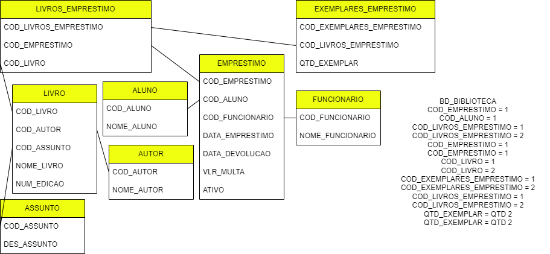

# 📂 BD\_Biblioteca

Este diretório faz parte da disciplina **Banco de Dados**, ministrada pelo **Prof. Dr. João Paulo Aramuni**, no curso de **Análise e Desenvolvimento de Sistemas** do **Centro Universitário Newton Paiva**.

## 📌 Conteúdo da pasta

* **Script SQL (`.sql`)**

  * Contém a criação do banco de dados **Biblioteca**, com as seguintes tabelas principais:

    * **ALUNO** – cadastro de estudantes.
    * **FUNCIONARIO** – registro de funcionários responsáveis pelos empréstimos.
    * **AUTOR** – dados dos autores dos livros.
    * **ASSUNTO** – classificação dos livros por assunto.
    * **GENERO** – categorização por gênero literário.
    * **LIVRO** – informações bibliográficas (vinculado a autor, assunto e gênero).
    * **ESTOQUE** – controle da quantidade disponível de cada livro.
    * **EMPRESTIMO** – dados dos empréstimos realizados (aluno, funcionário, datas, multa, ativo/inativo).
    * **LIVROS\_EMPRESTIMO** – vinculação entre os empréstimos e os livros emprestados.
    * **EXEMPLARES\_EMPRESTIMO** – quantidade de exemplares de cada livro em cada empréstimo.
   
   Projeto detalhado:
  

## 🎯 Objetivo

O projeto teve como objetivo:

* Modelar um **sistema de biblioteca universitária** para controle de alunos, funcionários, livros, estoque e empréstimos.
* Explorar conceitos de **integridade referencial, chaves primárias, estrangeiras e índices únicos**.
* Implementar a estrutura em **SQL**, refletindo as regras de negócio comuns a bibliotecas (múltiplos exemplares, controle de devolução e multas).

## 🛠️ Ferramentas utilizadas

* **SQL (DDL)** → para criação da estrutura do banco de dados.
* **Conceitos de modelagem relacional** aplicados ao domínio de bibliotecas.

---

📚 **Disciplina**: Banco de Dados
👨‍🏫 **Professor**: Dr. João Paulo Aramuni
🏫 **Instituição**: Centro Universitário Newton Paiva

