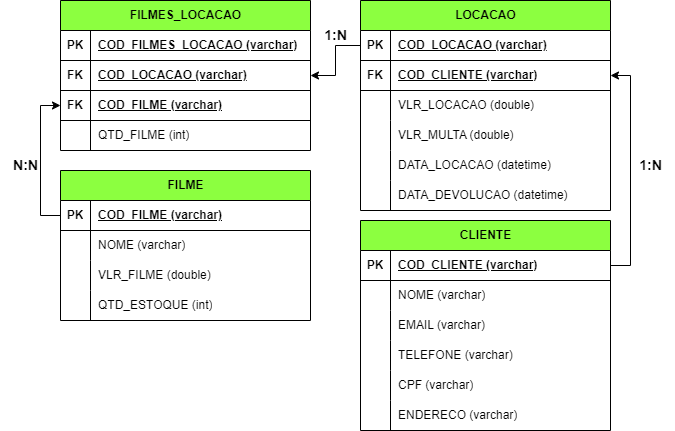

# 📂 BD\_Locacao

Este diretório faz parte da disciplina **Banco de Dados**, ministrada pelo **Prof. Dr. João Paulo Aramuni**, no curso de **Análise e Desenvolvimento de Sistemas** do **Centro Universitário Newton Paiva**.

## 📌 Conteúdo da pasta

* **Diagrama Lógico (DER)**

  * Arquivo em formato `.drawio`
  * Imagem exportada do diagrama do projeto lógico, representando as entidades e relacionamentos.
  

* **Script SQL (`.sql`)**

  * Contém a criação do banco de dados **Locação**, com as seguintes tabelas principais:

    * **CLIENTE** – cadastro de clientes com dados pessoais e de contato.
    * **FILME** – catálogo de filmes disponíveis, incluindo preço e quantidade em estoque.
    * **LOCACAO** – registro das locações realizadas, com valores, datas e vínculo ao cliente.
    * **FILMES\_LOCACAO** – associação entre locações e filmes alugados, incluindo quantidade.

## 🎯 Objetivo

O projeto teve como objetivo:

* Modelar um **sistema de locação de filmes**.
* Permitir o gerenciamento de clientes, catálogo de filmes, controle de estoque e registro de locações.
* Aplicar conceitos de **chaves primárias, estrangeiras, integridade referencial e relacionamentos 1\:N e N\:M**.

## 🛠️ Ferramentas utilizadas

* **Draw\.io** → para modelagem do diagrama lógico.
* **SQL (DDL)** → para criação da estrutura do banco de dados.

---

📚 **Disciplina**: Banco de Dados
👨‍🏫 **Professor**: Dr. João Paulo Aramuni
🏫 **Instituição**: Centro Universitário Newton Paiva

